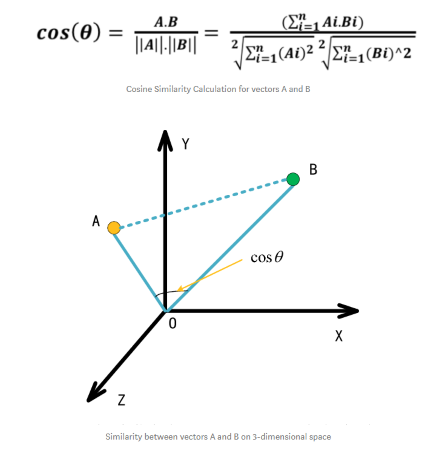
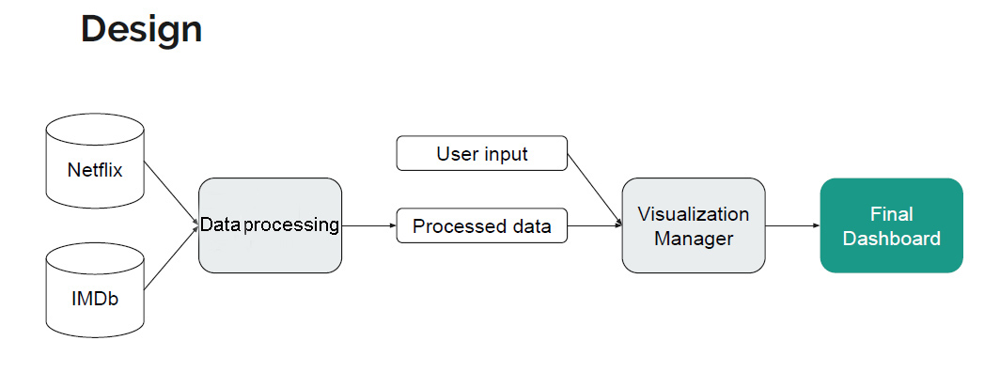

# Movie Recommendation Engine
## Objective
Devise a Movie Recommendation System based Netflix and IMDB dataset using collaborative filtering and cosine similarity. Produce a user interface to suggest content based on genre & time using Dash (Python)

## Introduction
With the current advancements of so many online streaming websites for movies, one can now watch any movie or show old and new. However, with such a sheer volume of movies, it becomes overwhelming to browse among them and find a movie of one’s choice and taste. We have built a collaborative filtering-based recommendation system that provides movie and TV show suggestions based on the user’s preference and liking.

### Recommendation system:
A recommender framework, or a proposal framework (now and again supplanting ‘framework’ with an equivalent word, for example, stage or motor), is a subclass of data separating framework that tries to foresee the “rating” or “inclination” a client would provide for a thing. They are essentially utilized in business applications.

### Cosine Similarity
Cosine similarity is the measure of similarity between two vectors, by computing the cosine of the angle between two vectors projected into multidimensional space. It can be applied to items available on a dataset to compute similarity to one another via keywords or other metrics. Similarity between two vectors (A and B) is calculated by taking the dot product of the two vectors and dividing it by the magnitude value as shown in the equation below. We can simply say that the CS score of two vectors increases as the angle between them decreases.

One key advantage of collaborative filtering is that it is independent of product knowledge. Rather, it relies on the users with a basic assumption that what the users liked in the past will also be liked in the future. For example, if a person A watches crime, sci-fi, and thriller genres and B watches sci-fi, thriller, and action genres then A will also like action, and B will like crime genre.

Finally, I provided a visualization tool for users to access our recommender system through a web application built in Dash and deployed the tool in Heroku.

## Python Libraries Used
- Pandas (https://pandas.pydata.org/)
- Scikit-learn (https://scikit-learn.org/)
- Numpy (https://numpy.org/)
- Scipy (https://docs.scipy.org/)
- Dash
- Pickle

# Implementation

## Dataset

| Title | Location | Features | Highlights |
 :---- | :--- | :--- | :----- |
Netflix Training Dataset | __[Netflix Prize Data](https://www.kaggle.com/netflix-inc/netflix-prize-data)__: Training_set.rar | user_id, movie, date of grade, grade| It contains a training data set of  100,480,507 ratings that 480,189 users gave to 17,770 movies.|
Netflix Movie Information Dataset | __[Netflix Prize Data](https://www.kaggle.com/netflix-inc/netflix-prize-data#movie_titles.csv):__ movie_titles.txt | Movie_id, year of release, title | It contains details for around 17,770 movies |
IMDB’s Dataset |__[IMDB Data Files](https://www.imdb.com/interfaces/):__ title.basics.tsv.gz, title.ratings.tsv.gz | Genre of movie, start year, movie run time (minutes) |This dataset will be used to recommend a movie based on the genre selected by the user

## Pre-Processing

The preproccessing of the data is handled by `data_processing.py`. The Module is needed only once to create the preprocessed file. Run it again for any updated dataset if needed. It reads the movie data from both Netflix and IMDB data sources, merges and formats the data into usable dataframes,keeps only variables and observations of interest And finally, produce condensed csv files.

### Downloading dataset from kaggle:
- Install the kaggle package from the terminal: `pip install kaggle`
- Download the API Token from Kaggle: Go to [Kaggle website](https://www.kaggle.com/) -> Account -> API -> Create New API Token. This will download a json file with the following format: `{"username”:string_username,”key”:string_key}`
- Place the json file into the hidden `.kaggle/` folder, created when you installed the package. If you cannot find this folder, run the command `kaggle` on your terminal. This will give you an error that looks like this: *“Could not find kaggle.json. Make sure it's located in path/to/the/.kaggle/directory.”* From there, you can get path where you are supposed to store your json file.

## Working

The Netflix data will be used for the recommendation system based on an input movie, and the IMDB data for the recommendation of the most popular movies/series by year and genre. The data_processing module also calculates movie similarity scores for the Netflix data and weighted ratings for the IMDB data and outputs-
-  Movie recommendation dictionary: for each movie, we get the list of recommended
movies.
- Association between movie_id and title.
- Average rating and number of votes by movie, release year, and genre.

## DashBoard

The web module produces the visualization tool which shows the top movie recommendations based on user input. The first tab displays the choice-based recommendation, while the second tab shows the filter-based recommendation.

### Use Cases

#### Use Case 1: The user wants to see movies similar to a liked movie
- User: User inputs his/her liked movie
- Tool: Based on the user’s liked movie, a list of recommended movies will be displayed
- Explanation: The visualization manager will display to the user a list of top 10 recommended movies, ordered from the highest-matching movie to the lowest, based on a query to the processed data. The
processed data is obtained through an interaction with the data manager component, which
produces a set of the most highly-rated movies ranked by users who also liked the base movie.
In turn, the data manager component formats the raw data from Netflix to create a matrix based
on the cosine similarity between movies, outputting processed data of movies with the highest
similarity with the base movie.

#### Use Case 2: The user wants to see the top 10 movies of a particular year
- User: User inputs a particular year
- Tool: A list of the top 10 most recommended movies will be displayed
- Explanation: The visualization manager creates the processed data based on input
data from the IMDB dataset, subset to movies matching the features from the user criteria, and
generates a weighted rating calculated as the product of movie ratings and number of ratings to
determine the top movies to recommend.

#### Use Case 3: The user wants to see the top 10 movies from a particular genre
- User: User inputs the genre from a drop-down menu
- Tool: A list of the top 10 most recommended movies from that genre will be displayed

